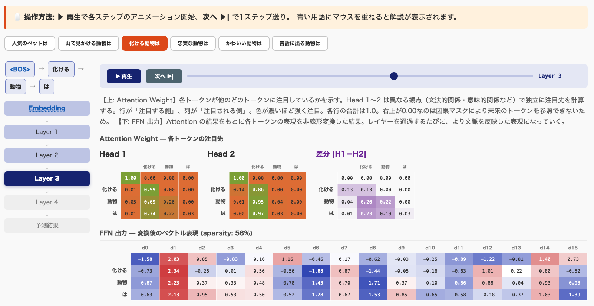

# Transformer Decoder Emulator

> An interactive educational tool that visualizes how Large Language Models (LLMs) work internally, step by step. Includes training animation and inference walkthrough with attention weights, FFN outputs, and next-token prediction. Built with NumPy only — no PyTorch/TensorFlow required. Currently Japanese UI only.

大規模言語モデル (LLM) の内部動作をステップごとに可視化する教育用ツール。

**[▶ オンラインデモを試す](https://Tomoiura.github.io/transformer-emulator/)** — インストール不要でブラウザから体験できます

<!-- スクリーンショットを追加したら以下のコメントを解除:

-->

## 概要

AI チャットがどのようにテキストを生成しているのか、その内部処理を1ステップずつ追体験できます。

- **学習**: ランダムな重みから始めて、実際にデータで学習する過程を可視化
- **Embedding**: トークンをベクトルに変換する過程
- **Self-Attention**: 各トークンが他のどのトークンに注目するかの計算
- **Feed-Forward Network (FFN)**: 文脈情報を使った表現の変換
- **次トークン予測**: 語彙から次の単語を選ぶ確率計算

結果はインタラクティブな HTML ファイルとして出力され、ブラウザで閲覧できます。

## クイックスタート

```bash
git clone https://github.com/Tomoiura/transformer-emulator.git
cd transformer-emulator
pip install -r requirements.txt
python main.py
```

実行すると学習→推論が行われ、`output/result.html` が生成されてブラウザで開きます。

## 使用例

```bash
# デフォルト（動物に関する質問と回答で学習）
python main.py

# 自分のプロファイルで実行
python main.py --profile profiles/my_data.json

# 追加の推論クエリを試す
python main.py --query "かわいい動物は"

# 学習パラメータを調整
python main.py --epochs 500 --lr 0.01

# 学習過程を詳細表示
python main.py --verbose

# 出力ファイルを指定
python main.py -o result.html
```

### 主なオプション

| オプション | デフォルト | 説明 |
|-----------|----------|------|
| `--profile` | `profiles/default.json` | プロファイル JSON ファイルパス |
| `--query` | (プロファイルに従う) | 追加の推論クエリ |
| `--epochs` | (プロファイルに従う) | 学習エポック数（プロファイルの値を上書き） |
| `--lr` | (プロファイルに従う) | 学習率（プロファイルの値を上書き） |
| `--verbose` | false | 学習過程を詳細表示 |
| `-o` | `output/result.html` | 出力 HTML ファイルパス |

## プロファイル JSON

学習データ、推論クエリ、モデル設定を1ファイルにまとめたものです。
テーマは自由に変更できます（動物、果物、都市、プログラミング言語など何でも OK）。

```json
{
  "title": "タイトル",
  "training_data": [
    {"input": "質問文A", "output": "答え1"},
    {"input": "質問文B", "output": "答え2"}
  ],
  "queries": ["推論で試す質問"],
  "model": {"layers": 4, "d_model": 16, "heads": 2},
  "training": {"epochs": 300, "lr": 0.005}
}
```

詳細は `profiles/default.json` を参照してください。

## 仕組み

1. プロファイル JSON から学習データを読み込み
2. 日本語トークナイザ (fugashi) でテキストを分割
3. 教育用の小規模 Transformer Decoder モデルを構築
4. NumPy のみでバックプロパゲーションを実装し、実際に学習
5. 学習済みモデルで推論し、各ステップの中間状態を記録
6. 全過程をインタラクティブな HTML として出力

実際の LLM は数千〜数万倍のパラメータを持ちますが、計算の流れは同じです。

## 動作環境

- Python 3.7+
- numpy
- fugashi
- unidic-lite

## フィードバック

技術的な誤りや説明の改善点があれば、[Issue](https://github.com/Tomoiura/transformer-emulator/issues) や Pull Request を歓迎します。

## 作者

**Tomohisa Iura** ([@Tomoiura](https://github.com/Tomoiura)) — tomo@kanadeki.jp

## ライセンス

MIT License - 詳細は [LICENSE](LICENSE) を参照してください。
